# Swarup Ingale

**Cybersecurity & IoT Engineering · B.E. 2027**

[portfolio](https://swale-os-portfolio.pages.dev/) &nbsp;·&nbsp;
[linkedin](https://www.linkedin.com/in/swarup-ingale-45864b295) &nbsp;·&nbsp;
[medium](https://swale.medium.com/) &nbsp;·&nbsp;
[github](https://github.com/Swarup-Ingale)

> Offensive security specialist & low-level systems builder. 
> Linux native, assembly fluent, kernel-curious — breaking things to understand how they work.

I focus on vulnerability research, reverse engineering, and building security tools from scratch —
from custom operating systems to kernel-level monitors. Currently hunting for a competitive
internship to apply advanced exploit development and secure system design.

<samp>mumbai, india &nbsp; · &nbsp; b.e. (exp. 2027) &nbsp; · &nbsp; seeking internships</samp>

**Languages & systems**

<samp>python &nbsp; c / c++ &nbsp; bash &nbsp; assembly (x86_64) &nbsp; typescript &nbsp; javascript</samp>

 

**Offensive & devsecops tooling**

<samp>burp suite &nbsp; metasploit &nbsp; sqlmap &nbsp; ghidra &nbsp; gdb &nbsp; wireshark &nbsp; nmap &nbsp; john &nbsp; hashcat</samp>

 

**Frameworks & infrastructure**

<samp>react &nbsp; node.js &nbsp; express &nbsp; docker &nbsp; qemu &nbsp; ebpf &nbsp; arduino &nbsp; lora &nbsp; git &nbsp; linux</samp>

**Kernel & exploit engineering** &nbsp;·&nbsp; <samp>low-level, offensive</samp> 
Custom OS development, assembly-level HTTP servers, kernel-level observability with eBPF,
and proprietary vulnerability scanners — the hard problems.

- **SUGAR-OS** &nbsp; 🚧 — Custom OS from scratch in C/C++ and x86_64 assembly. Kernel, process scheduler, memory management — no distro underneath.
- **asm-http-server** — Minimal HTTP GET/POST server written entirely in x86_64 Linux assembly via raw syscalls.
- **eBPF Security Monitor** — Kernel-level threat tracing and low-overhead network analysis using eBPF probes.
- **5W413 Vulnerability Scanner** &nbsp; 🚧 — Automated threat modeling engine in JS/TS for detecting algorithmic flaws across web architectures.

**Full-stack & applied systems** &nbsp;·&nbsp; <samp>web, ai, hardware</samp> 
Production apps, AI assistants, IoT prototyping — shipping things that solve real problems.

- **[Sentinel-X](https://sentinel-x-swale.pages.dev/)** &nbsp; 🟢 — Advanced defensive security platform against emerging digital threats.
- **[CypherVault](https://cyphervault-swale.pages.dev/)** &nbsp; 🟢 — Deliberately vulnerable web app for practicing CSRF, SSRF, SSTI, SQLi, XXE.
- **J.A.R.V.I.S.** — Tiered AI framework leveraging Claude/Antigravity for digital admin to physical robotics orchestration.
- **Edge AI Smart Traffic System** — Edge AI-driven traffic flow analysis and hardware optimization.
- **Autonomous Smart Trolley** — Arduino + GPS + LoRa IoT navigation system for retail automation.

👉 [all repositories](https://github.com/Swarup-Ingale?tab=repositories)

**CTF competitions**

| Event | Result |
|---|---|
| **RedX CTF** | 🥇 Global Rank **1st** — advanced exploitation under strict time constraints |
| **HackX CTF** | 🏅 Global Rank **4th** — 30,700 pts via multi-vector security modeling |
| **Uni6 CTF 1.0** | 🇮🇳 National Rank **27th** — nationwide competitive validation |

<samp>active competitor: &nbsp; redfox ctf 2026 &nbsp; · &nbsp; vishwactf '26 &nbsp; · &nbsp; kashi ctf &nbsp; · &nbsp; hackzero '26 &nbsp; · &nbsp; dark-ctf 2026</samp> 
<samp>regular solver: &nbsp; pwn.college &nbsp; · &nbsp; hackmyvm &nbsp; · &nbsp; dreamhack.io &nbsp; · &nbsp; pwnable.kr &nbsp; · &nbsp; olicyber &nbsp; · &nbsp; dockerlabs &nbsp; · &nbsp; vulnyx</samp>

**Certifications**

- **Introduction to Cybersecurity** — Cisco Networking Academy <samp>(credly verified)</samp>
- **Networking Basics** — Cisco Networking Academy <samp>(credly verified)</samp>
- **Advanced Cybersecurity & Python** — Udemy

**Currently learning**

- Advanced Web & API Exploitation <samp>(portswigger web security academy)</samp>
- Bug Bounty Reconnaissance & Workflows <samp>(hackerone, bugcrowd)</samp>
- Kernel Exploitation, eBPF Tracing, Advanced System Security
- Full-Stack Integration with IoT Devices

### 🐍 contribution grid

<picture>
  <source media="(prefers-color-scheme: dark)" srcset="https://raw.githubusercontent.com/Swarup-Ingale/Swarup-Ingale/output/github-contribution-grid-snake-dark.svg">
  <source media="(prefers-color-scheme: light)" srcset="https://raw.githubusercontent.com/Swarup-Ingale/Swarup-Ingale/output/github-contribution-grid-snake.svg">
  
</picture>

<pre>
███████╗██╗    ██╗ █████╗ ██████╗ ██╗   ██╗██████╗
██╔════╝██║    ██║██╔══██╗██╔══██╗██║   ██║██╔══██╗
███████╗██║ █╗ ██║███████║██████╔╝██║   ██║██████╔╝
╚════██║██║███╗██║██╔══██║██╔══██╗██║   ██║██╔═══╝
███████║╚███╔███╔╝██║  ██║██║  ██║╚██████╔╝██║
╚══════╝ ╚══╝╚══╝ ╚═╝  ╚═╝╚═╝  ╚═╝ ╚═════╝ ╚═╝

 ██████╗ ██████╗ ███████╗ █████╗ ██╗  ██╗    ██╗████████╗
 ██╔══██╗██╔══██╗██╔════╝██╔══██╗██║ ██╔╝    ██║╚══██╔══╝
 ██████╔╝██████╔╝█████╗  ███████║█████╔╝     ██║   ██║
 ██╔══██╗██╔══██╗██╔══╝  ██╔══██║██╔═██╗     ██║   ██║
 ██████╔╝██║  ██║███████╗██║  ██║██║  ██╗    ██║   ██║
 ╚═════╝ ╚═╝  ╚═╝╚══════╝╚═╝  ╚═╝╚═╝  ╚═╝    ╚═╝   ╚═╝

 ██████╗ ██╗   ██╗██╗██╗     ██████╗     ██╗████████╗
 ██╔══██╗██║   ██║██║██║     ██╔══██╗    ██║╚══██╔══╝
 ██████╔╝██║   ██║██║██║     ██║  ██║    ██║   ██║
 ██╔══██╗██║   ██║██║██║     ██║  ██║    ██║   ██║
 ██████╔╝╚██████╔╝██║███████╗██████╔╝    ██║   ██║
 ╚═════╝  ╚═════╝ ╚═╝╚══════╝╚═════╝     ╚═╝   ╚═╝
</pre>
